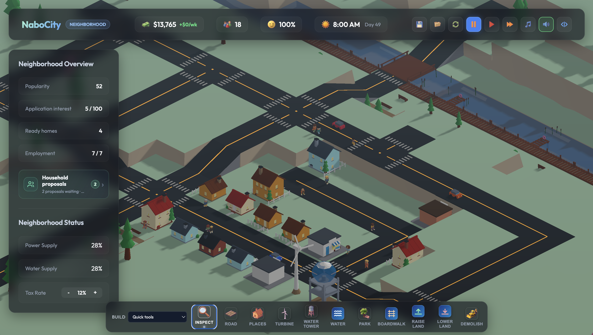

# NaboCity — Cozy Neighborhood Builder

NaboCity is a cozy, low-poly 3D neighborhood-building game about creating a small place where people know one another, help shape their surroundings, and make stories worth remembering.

Built using **Three.js** and **Vite** with **TypeScript**, the game runs completely client-side in the browser.

## North Star

> **Build a small place that grows organically and surprises the player—where people know one another, help shape their surroundings, and create stories worth remembering, with each neighborhood unfolding in its own unexpected way.**

The player should feel like a **caretaker, designer, and participant** in a community—not a distant mayor optimizing statistics. Growth is measured by attachment, expression, belonging, and the history of a place rather than population or urban scale. A tiny five-home neighborhood with deep relationships should be every bit as successful as a larger town.

### Design Principles

Every major feature should support at least two of these principles:

1. **Help the player know a resident.** People are persistent characters with homes, preferences, routines, relationships, and memories—not anonymous population units.
2. **Help the player express themselves.** Building and decorating should create recognizable, personal places rather than only solve coverage or efficiency problems.
3. **Create a visible neighborhood moment.** Systems should produce scenes the player can watch: visits, picnics, markets, celebrations, favors, and everyday routines.
4. **Make existing places more meaningful.** Prefer deepening homes, streets, gardens, shops, and gathering places over encouraging endless expansion.
5. **Create stories worth remembering.** Important arrivals, projects, friendships, events, and changes should become part of the neighborhood's persistent history.
6. **Support multiple valid play styles.** A compact garden village, creative waterfront, crafting community, or bustling market street should all be successful outcomes.
7. **Create delight without demanding optimization.** Friction should invite care, creativity, and compromise rather than punish the player with collapse or irreversible failure.
8. **Prioritize replayability and serendipity.** Use procedural generation and organic development so each neighborhood evolves in surprising, coherent ways, encouraging players to adapt to unexpected residents, relationships, opportunities, and places rather than follow a predetermined optimal path.

When evaluating work, the key question is not “does this make the simulation more realistic?” but **“does this help the neighborhood feel more personal, expressive, connected, memorable, or delightfully unexpected?”**

---

## 📸 Screenshot



---

## 🎮 Key Features

*   **Cozy 3D Visuals**: A beautiful low-poly style featuring dynamic lighting, warm sunsets, glowing home windows at night, day/night shadows that swing with the sun, and terrain sculpting across multiple elevation levels.
*   **A Living Neighborhood Simulation**:
    *   **Persistent Residents & Households**: Every resident is a named person with a stable identity, deterministic appearance, home, occupation, and daily routine. They persist across save/load.
    *   **Household Invitations**: Residential growth happens by choice, not demand bars. Review authored and procedurally generated household applications, prepare a vacant home, and invite the neighbors you want.
    *   **Named Places, Not Zones**: Build specific places from a catalog—cozy cottages, family homes, bakeries, cafés, florists, bookshops, pottery and carpenter workshops, community gardens, and more—each with its own cost, capacity, and character.
    *   **Hopes & Memories**: Residents carry personal hopes (like Rosa's wish for a shared garden). Fulfilling them creates visible moments—like a neighborhood picnic—and persistent memories attached to people and places.
    *   **Popularity & Applications**: A popularity score driven by your reputation and momentum generates application interest, attracting new prospective households over time.
    *   **Utilities Propagation**: Build wind turbines (power) and water towers (water). Connections propagate dynamically along roads and to connected structures using a Breadth-First Search (BFS) algorithm.
    *   **Gentle Economy**: Balance weekly tax revenue from settled residents and workplace staff against maintenance costs for roads, utilities, parks, and boardwalks.
*   **Procedural Audio Soundscape**: Synthesizes custom triangle-wave lofi jazz chord loops (`Fmaj7` - `Em7` - `Dm7` - `Cmaj7`), wind noise, vinyl record crackling, echoing pentatonic chime melodies, and build/bulldoze sound effects in real-time using the **Web Audio API**. Music and SFX preferences persist between sessions.
*   **Procedural Traffic & Pedestrians**: Colorful low-poly cars steer through junctions and switch on headlights at night, while residents walk scheduled routes between home, gardens, parks, and boardwalks—with readable intent like "Walking to a garden."
*   **Terrain Sculpting**: Raise and lower land across five elevation levels to shape hills, waterfronts, and terraces; build boardwalks over water and bridges across it.
*   **Save/Load & Auto-Save**: Versioned saves (currently v7) with migrations preserve tiles, residents, households, applications, popularity, and memories in browser `localStorage`.
*   **Buttery Smooth Pan/Zoom/Rotate Controls**: Glide around the map with inertia/momentum using WASD/Arrow keys or right-click drags.

---

## 🛠️ Controls Reference

### Building Tools Hotkeys
*   `1`: **Inspect** — Click a tile or resident to check details: zoning, occupants, happiness, power/water connectivity, household, routine, and hopes.
*   `2`: **Road** ($10) — Connect places. Drag-building is fully supported!
*   `3` / `4` / `5`: **Zone Plot** — Prepare a residential, commercial, or industrial plot. Then pick a specific place (cottage, bakery, workshop…) from the **Places** panel or the inspector's place selector to start construction.
*   `6`: **Turbine** ($500) — Wind turbine supplying power.
*   `7`: **Water Tower** ($400) — Cylindrical tank supplying water.
*   `8`: **Park** ($300) — Cozy green spaces that boost local happiness; can become community gardens.
*   `9`: **Boardwalk** ($10) — Wooden walkways over water.
*   `0`: **Water Body** ($10) — Sculpt ponds, canals, and waterfronts.
*   `[`: **Raise Land** ($50) — Lift an empty tile one elevation level (max 4).
*   `]`: **Lower Land** ($50) — Drop an empty tile one elevation level (min 0).
*   `B`: **Bulldozer** ($5) — Clear tiles. Drag-demolishing is supported!

### Game Speed
*   `Space`: Pause / resume.
*   `Tab`: Cycle speed — normal → fast → paused.
*   `Esc`: Close the Neighborhood Center modal.

### Mouse & Camera Navigation
*   **Move Camera**: Use **Arrow Keys** or **WASD** to slide around, or hold **Right Mouse Button** and drag.
*   **Rotate/Orbit Camera**: Hold **Shift + Right Mouse Button** and drag to rotate horizontal/vertical angles.
*   **Zoom**: Scroll the **Mouse Wheel** to slide in and out smoothly with damping.

---

## 🚀 Getting Started

### Prerequisites
*   Node.js (v18.0 or higher recommended, fully compatible with v16.13+)
*   NPM

### Installation
1.  Clone the repository or navigate to the directory:
    ```bash
    cd nabocity
    ```
2.  Install dependencies:
    ```bash
    npm install
    ```
3.  Start the local development server:
    ```bash
    npm run dev
    ```
4.  Open your browser and navigate to the address shown (usually `http://localhost:5173/`).

### Building for Production
To build and optimize the project for hosting:
```bash
npm run build
```
The output files will be built in the `dist/` directory.

---

## 📁 Project Structure
```
nabocity/
├── index.html              # Entry markup, HUD, toolbar, and modal layouts
├── package.json            # Dependency configurations
├── tsconfig.json           # TypeScript configuration
├── public/
│   ├── splash.jpg          # Low-poly splash screen artwork
│   ├── screenshot.png      # README gameplay screenshot
│   └── *_icon.png          # HUD and toolbar icons
└── src/
    ├── main.ts             # Entry bootloader script
    ├── index.css           # Glassmorphism UI styles
    └── game/
        ├── Game.ts         # Coordinator: UI binds, inspectors, modals, tick loops
        ├── Simulation.ts   # Logic: households, applications, places, economy, utilities BFS
        ├── PlaceCatalog.ts # Catalog: buildable place archetypes with costs and capacities
        ├── Renderer.ts     # Three.js: scene, shadows, camera lerps, day/night cycles
        ├── InputManager.ts # Raycasting: snaps, clicks, drag-to-build, terrain tools
        ├── CitizenManager.ts # Residents: meshes, schedules, destination-based routines
        ├── AssetGenerator.ts # Meshes: low-poly models & emissive lights
        ├── TrafficManager.ts # Cars: steering paths & lane offsets
        └── SoundManager.ts # Synthesizers: lofi chords, chimes, SFX, persisted settings
```
